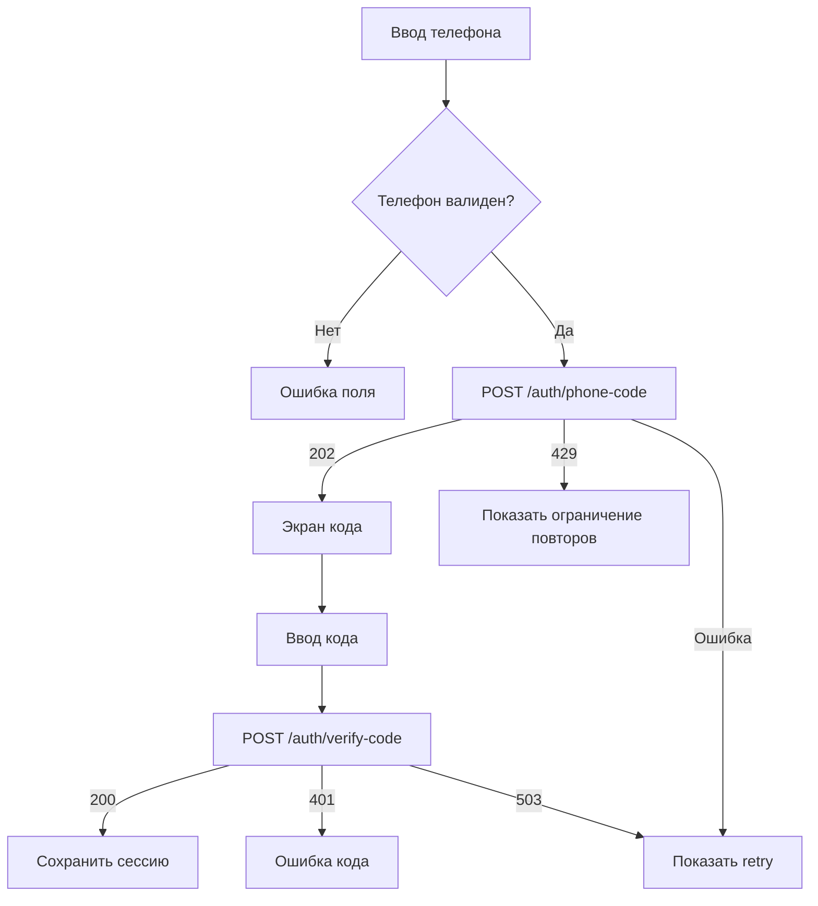
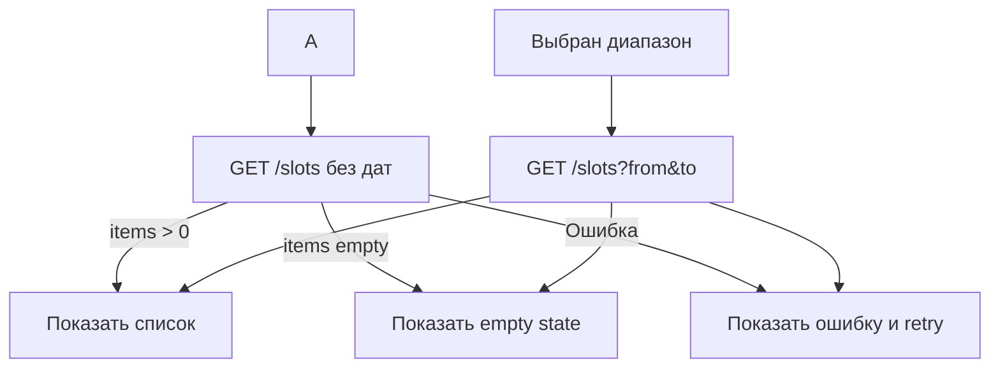
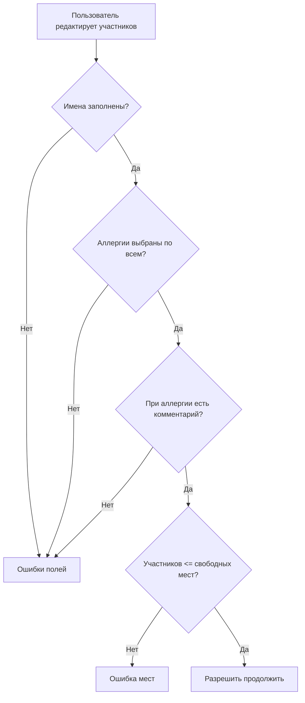
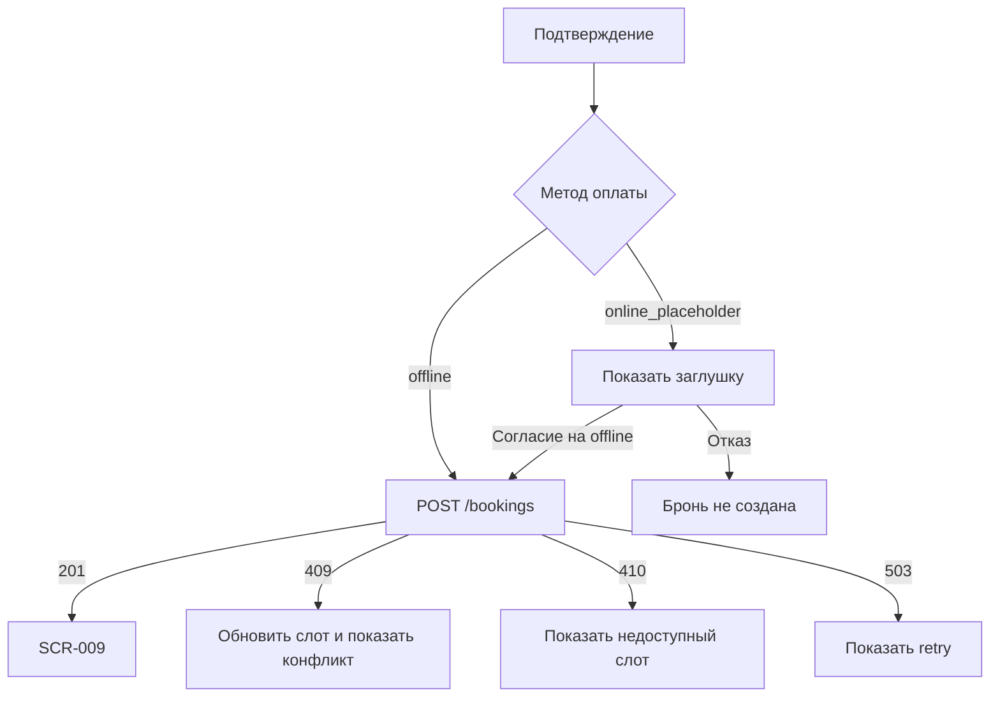
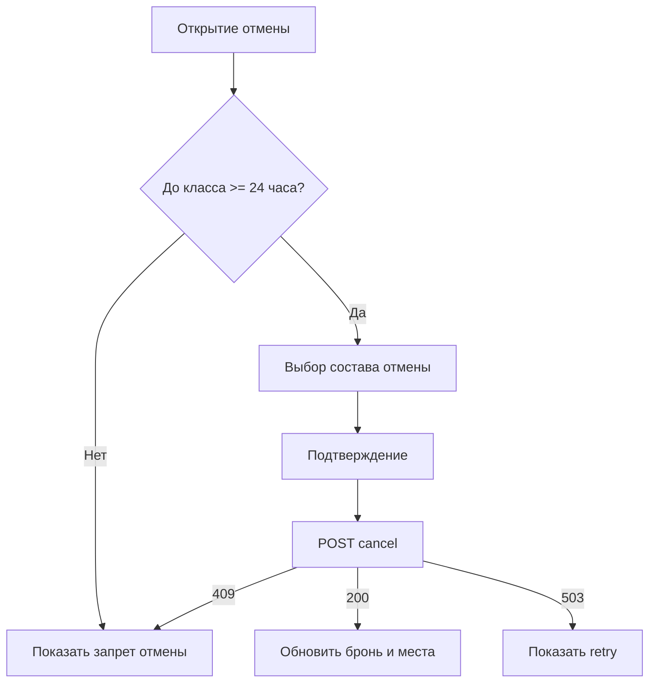

# Бизнес-логики приложения

## LOGIC-001. Авторизация по телефону

**Приоритет:** Высокий  
**Экраны:** SCR-001, SCR-002  
**API:** `POST /auth/phone-code`, `POST /auth/verify-code`, `GET /me`

Флоу:



Правила:
- аккаунт создаётся бэкендом автоматически при первом успешном входе;
- защищённые сценарии после входа возвращают пользователя к исходному действию;
- токен хранится в защищённом хранилище платформы.

## LOGIC-002. Загрузка расписания

**Приоритет:** Высокий  
**Экраны:** SCR-003, SCR-004  
**API:** `GET /slots`

Флоу:



Правила:
- если даты не переданы, API применяет ближайшие 7 дней;
- клиент не добавляет фильтры, которых нет в MVP;
- статус `full` или `cancelled_by_studio` должен визуально отличаться от доступного класса.
- адрес единственной студии, если показан в баннере, является статическим UI/UX-текстом макета и не запрашивается через API.

## LOGIC-003. Проверка формы участников

**Приоритет:** Высокий  
**Экраны:** SCR-006, SCR-012

Флоу:



Правила:
- статус аллергии должен быть явным: `none` или `has_allergy`;
- комментарий обязателен только для `has_allergy`;
- выбор инвентаря обязателен по каждому участнику;
- аллергии не сохраняются в профиле клиента.

## LOGIC-004. Расчёт суммы

**Приоритет:** Высокий  
**Экраны:** SCR-006, SCR-007, SCR-012  
**Данные:** `seatPrice`, `rentalPricePerParticipant`, `participants.equipmentOption`

Формула:

```text
total = seatPrice.amount * participantCount
      + rentalPricePerParticipant.amount * count(participants where equipmentOption = rental)
```

Правила:
- расчёт на клиенте предварительный;
- `expectedTotalAmount` отправляется в API для сверки;
- финальная сумма берётся из ответа `Booking.totalAmount`;
- при расхождении API может вернуть `validation_conflict`.

## LOGIC-005. Создание брони

**Приоритет:** Высокий  
**Экраны:** SCR-007, SCR-008, SCR-009  
**API:** `POST /bookings`

Флоу:



Правила:
- локальная подтверждённая бронь не создаётся до `201`;
- при `no_seats`, `stale_slot_data` или `participant_limit_exceeded` нужно обновить данные слота;
- при `slot_cancelled_or_unavailable` и `rebooking_forbidden` запись блокируется.

## LOGIC-006. Добавление участников

**Приоритет:** Высокий  
**Экраны:** SCR-011, SCR-012, SCR-007  
**API:** `POST /bookings/{bookingId}/participants`

Правила:
- доступно только для своей предстоящей брони;
- новые участники проходят ту же валидацию, что в создании брони;
- изменение считается успешным только после `200`;
- в ответе использовать обновлённые `booking` и `slot`.

## LOGIC-007. Отмена брони или участников

**Приоритет:** Высокий  
**Экраны:** SCR-011, SCR-013  
**API:** `POST /bookings/{bookingId}/cancel`, `POST /bookings/{bookingId}/participants/{participantId}/cancel`

Флоу:



Правила:
- клиент может отменять только свою бронь;
- удаление сущностей не используется, меняются статусы;
- правило 24 часов проверяется на клиенте для UX и на бэкенде как источник истины;
- при успехе показывается заглушка возврата денег.

## LOGIC-008. Отмена класса студией

**Приоритет:** Высокий  
**Экраны:** SCR-003, SCR-011, SCR-014  
**API:** `GET /bookings/my`, `GET /bookings/{bookingId}`, `GET /notifications/my`

Правила:
- приложение не инициирует отмену студией;
- при статусе `cancelled_by_studio` показывается заметное состояние;
- если `cancellationReason` пустой, использовать нейтральный текст;
- повторная запись на слот запрещена;
- клиент получает push и SMS, но UI строится по актуальному состоянию API.

## LOGIC-009. Напоминание о классе

**Приоритет:** Высокий  
**Экраны:** системное уведомление, SCR-011  
**API:** `GET /notifications/my`

Правила:
- напоминание отправляется за 1 день до класса;
- если хотя бы один участник выбрал `own`, текст должен напоминать об инвентаре;
- приложение по нажатию на push открывает детали брони.

## LOGIC-010. Оценка шефа

**Приоритет:** Средний  
**Экраны:** SCR-010, SCR-011, SCR-015  
**API:** `POST /chef-reviews`

Правила:
- оценка доступна только для `completed`;
- `rating` обязателен и принимает 1-5;
- `comment` необязателен;
- при `already_exists` показывается состояние уже отправленной оценки.

## LOGIC-011. Обработка ошибок API

**Приоритет:** Высокий  
**Все экраны с API**

| Ошибка | Поведение UI |
|---|---|
| `validation_error`, `invalid_phone` | Показать ошибку формы. |
| `invalid_code` | Показать ошибку кода. |
| `rate_limited` | Показать ограничение и время ожидания, если доступно. |
| `unauthorized` | Перевести в авторизацию. |
| `forbidden` | Показать запрет доступа без деталей чужих данных. |
| `not_found` | Показать, что запись или слот недоступны. |
| `no_seats`, `participant_limit_exceeded` | Показать нехватку мест и обновить слот. |
| `stale_slot_data` | Обновить данные слота и попросить подтвердить заново. |
| `slot_cancelled_or_unavailable`, `rebooking_forbidden` | Показать запрет записи. |
| `cancellation_window_closed` | Показать запрет отмены менее чем за 24 часа. |
| `booking_not_editable` | Показать, что бронь больше нельзя изменить. |
| `already_exists` | Показать состояние уже выполненного действия. |
| `temporary_unavailable` | Показать временную ошибку и возможность повтора. |
