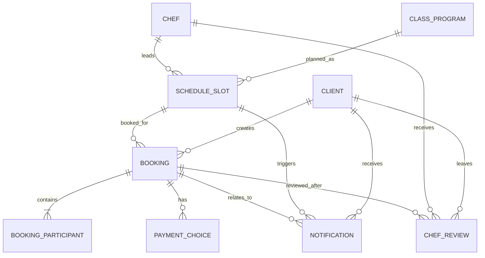

# Данные и доступ

## 1. Принцип владения данными

Клиентское приложение не является источником истины для расписания, мест и броней. Оно хранит только сессию, временные UI-состояния и черновики форм. Все бизнес-сущности подтверждаются API.

| Метка | Значение |
|---|---|
| Read-only | Приложение читает данные из API или статической конфигурации. |
| Mutated via API | Приложение инициирует изменение, но финальное состояние подтверждает бэкенд. |
| Local draft | Временное состояние формы на устройстве до отправки. |

## 2. Сущности

| Сущность | Режим | Источник истины | Комментарий |
|---|---|---|---|
| Client | Mutated via API | Бэкенд | Создаётся/возвращается при успешной авторизации. |
| ClassProgram | Read-only | Бэкенд | Программа, меню, сложность. |
| Chef | Read-only | Бэкенд | Имя и рейтинг. |
| ScheduleSlot | Read-only | Бэкенд | Дата, время, места, статус, цены, инвентарь. |
| Booking | Mutated via API | Бэкенд | Создание, добавление участников, отмена. |
| BookingParticipant | Mutated via API | Бэкенд | Имя, аллергии, инвентарь, статус. |
| PaymentChoice | Mutated via API | Бэкенд | Оффлайн-оплата или онлайн-заглушка. |
| ChefReview | Mutated via API | Бэкенд | Оценка после завершения класса. |
| Notification | Read-only | Бэкенд / push-SMS | Приложение отображает последствия уведомлений. |
| BookingDraft | Local draft | Устройство | Черновик до отправки, не является бронью. |

## 3. ER-диаграмма

## 4. Матрица доступа

| Сущность | Гость | Авторизованный клиент | Приложение локально | Бэкенд/админка | Правило |
|---|---|---|---|---|---|
| Client | - | R, частично C/U через авторизацию | сессия | C/R/U | Только свой профиль. |
| ClassProgram | R | R | кэш отображения | C/R/U вне приложения | Без редактирования в приложении. |
| Chef | R | R | кэш отображения | C/R/U вне приложения | Только показ имени и рейтинга. |
| ScheduleSlot | R | R | кэш отображения | C/R/U вне приложения | Доступность только по API. |
| Booking | - | C/R/U только свои | черновик | C/R/U | Удаления нет, только статусы. |
| BookingParticipant | - | C/R/U только в своих бронях | черновик | C/R/U | В составе своей брони. |
| PaymentChoice | - | C/R/U в своей брони | выбор формы | C/R/U | Фиксируется после подтверждения. |
| ChefReview | - | C/R только по своей завершённой брони | форма | C/R/U | Один отзыв на бронь. |
| Notification | - | R только свои | отображение | C/R/U | Планирование вне приложения. |
| BookingDraft | - | C/R/U/D | C/R/U/D | - | Не бизнес-сущность. |

## 5. Персональные данные

Обрабатываются:
- телефон клиента;
- имя основного клиента;
- имена участников;
- бинарный статус аллергии;
- комментарий об аллергии;
- выбранный инвентарь;
- история броней и отзывов клиента.

Правила:
1. Телефон используется для входа и связи.
2. Аллергии относятся только к конкретному участнику конкретной брони.
3. Аллергии не переносятся в профиль и не переиспользуются автоматически.
4. Данные чужих броней не должны отображаться.
5. При ошибке API черновик не становится подтверждённой бронью.

## 6. Инварианты

1. Приложение не создаёт и не редактирует расписание, программы, шефов и административные отмены.
2. Бронь считается созданной только после успешного ответа API.
3. Добавление участников и отмена считаются выполненными только после ответа API.
4. Свободные места не являются клиентским расчётом.
5. Клиентская отмена доступна не позднее чем за 24 часа до `startsAt`.
6. Отменённый студией слот недоступен для повторной записи.
7. Уведомления являются следствием состояния брони/слота, а не отдельным клиентским действием.
8. Адрес единственной студии не является сущностью, API-данными, локальным кэшем или seed-данными; его наличие на баннере относится только к статическому UI/UX-макету.

## 7. Локальное хранение

| Данные | Где хранить | Требования |
|---|---|---|
| Access token | Защищённое хранилище платформы | Не логировать, очищать при logout/401. |
| Черновик брони | Локальное состояние/краткоживущий кэш | Не считать подтверждённой бронью. |
| Последний выбранный диапазон дат | Локальное состояние | Можно сбросить к 7 дням. |
| Кэш расписания | Краткоживущий кэш | Обновлять при конфликтах и pull-to-refresh. |

## 8. Границы ответственности

| Зона | Ответственный |
|---|---|
| Проверка владения бронью | Бэкенд |
| Проверка свободных мест | Бэкенд |
| Запрет двойного бронирования | Бэкенд |
| Правило 24 часов | Бэкенд, клиент дополнительно предупреждает |
| Предварительная валидация формы | Приложение |
| Предварительная сумма | Приложение |
| Финальная сумма | Бэкенд |
| Push/SMS отправка | Бэкенд / инфраструктура уведомлений |
| Отображение статусов и сообщений | Приложение |
