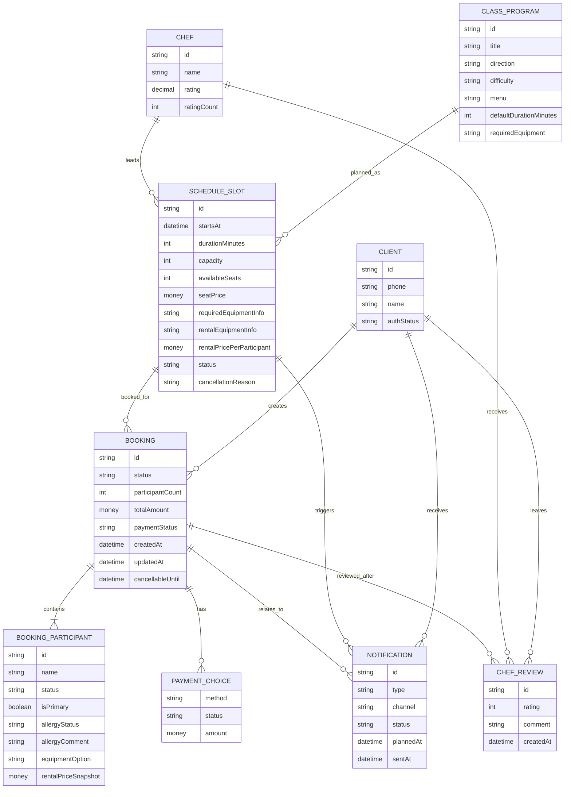

# ER-модель и модели сущностей

## Назначение документа

Документ фиксирует логическую модель данных для клиентского мобильного приложения кулинарной студии «Шеф-стол». Модель описывает API-контракт и клиентский домен, а не внутреннюю схему данных существующего бэкенда.

Канонический источник истины для расписания, доступности, статусов и атомарного изменения мест - существующий бэкенд. Приложение не создаёт локально неподтверждённые брони и меняет данные только через подтверждённый ответ API.

## Легенда владения данными

| Метка | Значение |
|---|---|
| Read-only | Приложение только читает сущность из API или локальной статической конфигурации. Создание и редактирование вне скоупа приложения. |
| Mutated via API | Приложение инициирует создание или изменение сущности через API, но финальное состояние подтверждает бэкенд. |
| Local draft | Временное состояние формы на устройстве до отправки в API; не считается сохранённой бизнес-сущностью. |

## ER-модель

Адрес студии не выделяется в отдельную ER-сущность и не входит в API/БД/seed-модель: в MVP зафиксирована одна студия и один неизменяемый адрес, поэтому его показ на баннере относится исключительно к статическому UI/UX-макету.

## Владение и изменяемость сущностей

| Сущность | Источник истины | Режим приложения | Комментарий |
|---|---|---|---|
| Client / клиент | Бэкенд | Mutated via API | Приложение инициирует вход по телефону; при первом успешном входе бэкенд создаёт аккаунт. |
| ClassProgram / программа класса | Бэкенд | Read-only | Приложение показывает программу, меню и сложность. |
| Chef / шеф | Бэкенд | Read-only | Приложение показывает имя и рейтинг; интерфейс шефа вне скоупа. |
| ScheduleSlot / слот расписания | Бэкенд | Read-only | Приложение читает дату, время, вместимость, свободные места, статус, требования к инвентарю и условия проката для конкретного класса. Изменение слота делает бэкенд при бронировании/отмене. |
| Booking / бронь | Бэкенд | Mutated via API | Приложение создаёт бронь, добавляет участников, отменяет бронь или участников только через API. |
| BookingParticipant / участник брони | Бэкенд | Mutated via API | Создаётся при бронировании или добавлении участников; хранит имя, статус, бинарный признак аллергии, комментарий при наличии аллергии, выбор своего/арендного инвентаря и может быть отменён отдельно. |
| PaymentChoice / выбор оплаты | Бэкенд | Mutated via API | В MVP реальной онлайн-оплаты нет; оффлайн-оплата передаётся как выбранный способ. |
| ChefReview / оценка шефа | Бэкенд | Mutated via API | Создаётся после завершённого класса; повторная оценка той же брони не предполагается. |
| Notification / уведомление | Бэкенд / push-SMS инфраструктура | Read-only для приложения | Приложение получает push/SMS и отображает связанный статус; планирование и отправка вне клиентского UI. |
| BookingDraft / черновик брони | Устройство клиента | Local draft | Существует только до отправки формы; при отказе API не превращается в бронь. |

## Модели сущностей

### Client

Клиент - единственная активная пользовательская роль приложения.

Основные поля:
- `id` - идентификатор клиента в API.
- `phone` - номер телефона для входа и связи.
- `name` - имя основного клиента, собирается при оформлении записи.
- `authStatus` - состояние авторизации на клиенте.

Правила:
- аккаунт может быть создан бэкендом при первом успешном входе;
- аллергии и пищевые ограничения не сохраняются в профиле клиента;
- клиент видит только свои брони и связанные уведомления.

### ClassProgram

Описание содержательной программы занятия.

Основные поля:
- `id`;
- `title`;
- `direction`;
- `difficulty`;
- `menu`;
- `defaultDurationMinutes`;
- `requiredEquipment`.

Правила:
- программа приходит из бэкенда;
- приложение не создаёт и не редактирует программы;
- приложение не предоставляет клиенту информацию об аллергенной опасности меню;
- ограничения программы могут снижать вместимость конкретного слота.

### Chef

Шеф, ведущий класс.

Основные поля:
- `id`;
- `name`;
- `rating`;
- `ratingCount`.

Правила:
- шеф не является пользователем текущего приложения;
- рейтинг отображается в карточке класса;
- изменение среднего рейтинга является следствием сохранённых отзывов на бэкенде.

### ScheduleSlot

Конкретный экземпляр класса в расписании.

Основные поля:
- `id`;
- `programId`;
- `chefId`;
- `startsAt`;
- `durationMinutes`;
- `capacity`;
- `availableSeats`;
- `seatPrice`;
- `requiredEquipmentInfo`;
- `rentalEquipmentInfo`;
- `rentalPricePerParticipant`;
- `status`: `available`, `full`, `cancelled_by_studio`, `completed`;
- `cancellationReason`.

Правила:
- по умолчанию API возвращает слоты на ближайшие 7 дней;
- пользователь может запросить другой диапазон дат;
- приложение не создаёт и не редактирует слоты;
- повторная запись на слот со статусом `cancelled_by_studio` запрещена;
- свободные места пересчитываются бэкендом после бронирования или отмены;
- требования к инвентарю и условия проката показываются как свойства конкретного класса/слота, без отдельного каталога прокатных сетов;
- `rentalEquipmentInfo` описывает, что именно клиент получает при выборе проката, в свободной форме;
- `rentalPricePerParticipant` используется для расчёта итоговой суммы по участникам, выбравшим прокат;
- в MVP доступность прокатных наборов не ограничивает запись;
- если прокат для класса не нужен или недоступен, API может вернуть пустое описание и нулевую цену.

### Booking

Бронь клиента на конкретный слот.

Основные поля:
- `id`;
- `clientId`;
- `slotId`;
- `status`: `confirmed`, `offline_payment_pending`, `cancelled_by_client`, `cancelled_by_studio`, `completed`;
- `participantCount`;
- `totalAmount`;
- `paymentStatus`;
- `createdAt`;
- `updatedAt`;
- `cancellableUntil`.

Правила:
- бронь создаётся только после успешного ответа API;
- индивидуальная и групповая запись представлены одной моделью с разным числом участников;
- добавление участников меняет бронь через API и возможно только при наличии мест;
- клиентская отмена всей брони доступна не позднее чем за 24 часа до начала класса;
- при отмене класса студией бронь не удаляется, а получает статус `cancelled_by_studio` и причину.

### BookingParticipant

Участник внутри брони.

Основные поля:
- `id`;
- `bookingId`;
- `name`;
- `isPrimary`;
- `status`: `active`, `cancelled_by_client`, `cancelled_by_studio`;
- `allergyStatus`: `none`, `has_allergy`;
- `allergyComment`;
- `equipmentOption`: `own`, `rental`;
- `rentalPriceSnapshot`.

Правила:
- у каждого участника обязательно есть имя;
- для каждого участника обязателен явный бинарный выбор: аллергии есть или аллергий нет;
- если выбран `has_allergy`, участник сам описывает детали в `allergyComment`, и комментарий обязателен;
- если выбран `none`, `allergyComment` может быть пустым;
- данные об аллергиях не переносятся в профиль клиента и относятся только к конкретному участнику конкретной брони;
- выбор инвентаря хранится прямо в участнике: свой инвентарь или прокат;
- если выбран `rental`, `rentalPriceSnapshot` фиксирует цену проката на момент подтверждения брони;
- если выбран `own`, `rentalPriceSnapshot` равен 0, а напоминание может включать текст про необходимость взять инвентарь;
- отдельного участника групповой брони можно отменить не позднее чем за 24 часа до класса;
- отмена участника должна освобождать место только после подтверждения API.

### PaymentChoice

Выбор способа оплаты.

Основные поля:
- `method`: `offline`, `online_placeholder`;
- `status`: `selected`, `placeholder_shown`, `fallback_to_offline`;
- `amount`.

Правила:
- реальная онлайн-оплата не входит в MVP;
- при выборе онлайн-оплаты приложение показывает заглушку;
- если клиент после заглушки выбирает оффлайн-оплату, приложение отправляет запрос создания брони;
- если клиент отказывается от оффлайн-оплаты, бронь не создаётся.

### ChefReview

Оценка шефа после завершённого класса.

Основные поля:
- `id`;
- `bookingId`;
- `clientId`;
- `chefId`;
- `rating` от 1 до 5;
- `comment`;
- `createdAt`.

Правила:
- оценка доступна только для завершённого класса;
- оценка обязательна для отправки, текстовый отзыв необязателен;
- повторная отправка для той же брони должна обрабатываться как уже существующая оценка.

### Notification

Уведомление клиенту.

Основные поля:
- `id`;
- `clientId`;
- `bookingId`;
- `slotId`;
- `type`: `class_reminder`, `studio_cancelled_class`;
- `channel`: `push`, `sms`;
- `status`;
- `plannedAt`;
- `sentAt`.

Правила:
- напоминание отправляется за 1 день до начала класса;
- при отмене класса студией отправляются push и SMS;
- приложение не планирует рассылку, но должно корректно отобразить последствия уведомления в статусах брони и слота.

## Sequence-диаграмма с ветками

```mermaid
sequenceDiagram
    autonumber
    actor Client as Клиент
    participant App as Мобильное приложение
    participant API as API / существующий бэкенд
    participant Notify as Push/SMS сервис

    Client->>App: Открывает расписание
    App->>API: GET /slots?from=today&to=today+7d
    API-->>App: Слоты, программы, шефы, условия проката, доступность

    alt Слоты есть
        App-->>Client: Показывает расписание
    else Слотов нет
        App-->>Client: Показывает empty state "Пока нет доступных классов"
    end

    opt Клиент выбирает другой диапазон дат
        Client->>App: Выбирает даты
        App->>API: GET /slots?from=selectedFrom&to=selectedTo
        API-->>App: Обновлённый список слотов
        App-->>Client: Показывает результат фильтра
    end

    Client->>App: Открывает карточку класса
    App->>API: GET /slots/{slotId}
    API-->>App: Детали класса, мест, цены и условий проката
    App-->>Client: Показывает карточку и условия отмены

    Client->>App: Заполняет участников
    App->>App: Проверяет имена, аллергии, инвентарь, сумму

    alt Не заполнены обязательные данные
        App-->>Client: Показывает ошибки формы
    else Данные заполнены
        Client->>App: Выбирает способ оплаты

        alt Онлайн-оплата выбрана
            App-->>Client: Показывает заглушку онлайн-оплаты
            alt Клиент согласен на оффлайн-оплату
                Client->>App: Подтверждает оффлайн-оплату
                App->>API: POST /bookings
            else Клиент не согласен
                App-->>Client: Возврат без создания брони
            end
        else Оффлайн-оплата выбрана
            App->>API: POST /bookings
        end

        alt API подтвердил бронь
            API-->>App: Booking confirmed / offline_payment_pending
            App-->>Client: Показывает успешную запись
            App->>API: GET /bookings/my
            API-->>App: Список броней клиента
        else Нет мест или устаревшие данные
            API-->>App: typed_error no_seats / stale_slot
            App->>API: GET /slots/{slotId}
            API-->>App: Актуальная доступность
            App-->>Client: Сообщение об отказе и обновлённые места
        else Слот отменён студией или повторная запись запрещена
            API-->>App: typed_error slot_cancelled / rebooking_forbidden
            App-->>Client: Статус отмены и запрет записи
        else Ошибка валидации или сервер временно недоступен
            API-->>App: typed_error validation / temporary_unavailable
            App-->>Client: Понятное сообщение без создания локальной брони
        end
    end

    opt Клиент добавляет участников в предстоящую бронь
        Client->>App: Добавляет участников
        App->>API: POST /bookings/{bookingId}/participants
        alt API подтвердил добавление
            API-->>App: Обновлённая бронь и доступность
            App-->>Client: Показывает обновлённую бронь
        else Мест недостаточно или бронь уже недоступна для изменения
            API-->>App: typed_error no_seats / validation
            App-->>Client: Показывает отказ и актуальные данные
        end
    end

    opt Клиент отменяет бронь или участников
        Client->>App: Выбирает отмену
        alt До класса менее 24 часов
            App-->>Client: Отмена заблокирована правилом 24 часов
        else Отмена разрешена
            App->>API: POST /bookings/{bookingId}/cancel
            alt API подтвердил отмену
                API-->>App: Обновлённая бронь и освобождённые места
                App-->>Client: Показывает отмену и заглушку возврата
            else API отказал
                API-->>App: typed_error validation / temporary_unavailable
                App-->>Client: Показывает понятное сообщение
            end
        end
    end

    opt Студия отменяет класс во внешней админке
        API->>Notify: Запланировать push и SMS клиентам
        Notify-->>Client: Push/SMS об отмене
        App->>API: GET /bookings/my
        API-->>App: Бронь cancelled_by_studio с причиной
        App-->>Client: Показывает отмену, причину и инструкцию по возврату
    end

    opt Класс завершён
        App->>API: GET /bookings/my
        API-->>App: Бронь completed, оценка доступна
        Client->>App: Ставит оценку шефу
        App->>API: POST /chef-reviews
        alt Оценка сохранена
            API-->>App: Review created
            App-->>Client: Показывает успешную отправку
        else Оценка уже была отправлена или API недоступен
            API-->>App: typed_error already_exists / temporary_unavailable
            App-->>Client: Показывает соответствующее состояние
        end
    end
```

## Инварианты модели

1. Приложение не изменяет расписание, программы, шефов, условия проката и административные отмены.
2. Бронь, участники, аллергии, выбор инвентаря, выбор оплаты, отмена и оценка шефа считаются сохранёнными только после подтверждения API.
3. Свободные места никогда не вычисляются клиентом как источник истины; клиент может считать предварительную сумму и валидировать форму, но доступность подтверждает бэкенд.
4. Аллергии и пищевые ограничения живут только внутри `BookingParticipant`.
5. Клиентская отмена разрешена не позднее чем за 24 часа до `ScheduleSlot.startsAt`.
6. При отмене класса студией слот и бронь получают статусы отмены, а повторная запись на такой слот запрещена.
7. Уведомления являются следствием состояния брони или слота, а не отдельным клиентским действием.
