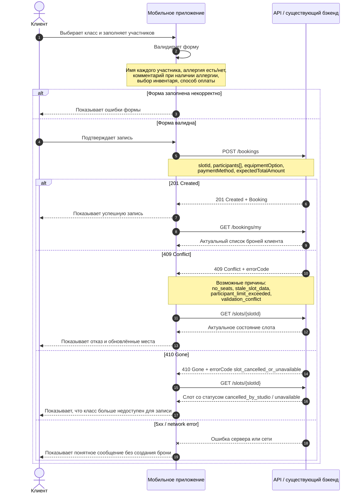

# SEQ. Создание брони

## Назначение

Диаграмма фиксирует API-сценарий создания брони из мобильного приложения с основными ветками ответа:
- `201 Created` - бронь создана;
- `409 Conflict` - бронь не создана из-за конфликта состояния слота или мест;
- `410 Gone` - слот больше недоступен для бронирования.

## Sequence-диаграмма

## Правила обработки

1. При `201 Created` приложение считает бронь созданной только по телу ответа API.
2. При `409 Conflict` приложение не создаёт локальную бронь, обновляет слот и предлагает пользователю выбрать доступное количество мест или другой класс.
3. При `410 Gone` приложение не повторяет запрос создания брони для этого слота и показывает состояние недоступности.
4. При сетевой ошибке или `5xx` приложение не создаёт локальную бронь и предлагает повторить действие позже.
5. Черновик формы может сохраняться локально, но не является бизнес-сущностью.
