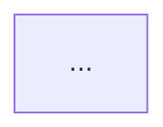

# Флоучарт экранов приложения

```mermaid
%%{init: {"flowchart": {"useMaxWidth": false}, "themeVariables": {"fontSize": "16px"}}}%%
flowchart TD
    ...
```

```mermaid
flowchart TD
    Start([Старт приложения])

    subgraph Auth[Авторизация]
        SCR001[SCR-001<br/>Ввод телефона]
        SCR002[SCR-002<br/>Код подтверждения]
        AuthError[Ошибка входа<br/>неверный код / сеть]
    end

    subgraph Catalog[Расписание и выбор класса]
        SCR003[SCR-003<br/>Расписание классов]
        SCR004[SCR-004<br/>Фильтр даты]
        EmptyState[Пока нет доступных классов]
        ListError[Ошибка загрузки расписания]
        SCR005[SCR-005<br/>Карточка класса]
        SlotUnavailable[Мест нет / слот отменён]
    end

    subgraph Booking[Оформление записи]
        SCR006[SCR-006<br/>Оформление записи: участники]
        ValidationError[Ошибка заполнения<br/>аллергии / участники / инвентарь]
        CapacityError[Мест не хватает<br/>данные слота обновлены]
        SCR007[SCR-007<br/>Оплата и подтверждение]
        SCR008[SCR-008<br/>Онлайн-оплата недоступна]
        ApiError[Отказ API<br/>нет мест / устаревшие данные / валидация]
        SCR009[SCR-009<br/>Успешная запись]
    end

    subgraph Account[Аккаунт и управление записью]
        SCR010[SCR-010<br/>Аккаунт / мои записи]
        SCR011[SCR-011<br/>Детали брони]
        SCR012[SCR-012<br/>Добавление участников]
        SCR013[SCR-013<br/>Отмена записи]
        CancelBlocked[Отмена недоступна<br/>менее 24 часов до класса]
        RefundStub[Заглушка возврата денег]
        SCR014[SCR-014<br/>Отмена класса студией]
        SCR015[SCR-015<br/>Оценка шефа]
    end

    subgraph Legal[Справочная информация]
        SCR016[SCR-016<br/>Условия и политика данных]
    end

    PushReminder[[Push-напоминание<br/>за 1 день до класса]]
    PushCancel[[Push + SMS<br/>отмена класса студией]]
    PushReview[[Push<br/>оценить шефа]]

    Start --> SCR003
    SCR003 -. "Мои записи без авторизации" .-> SCR001
    SCR005 -. "Глобально: Расписание" .-> SCR003
    SCR006 -. "Глобально: Расписание / Мои записи; черновик очищается" .-> SCR003
    SCR006 -. "Мои записи без авторизации" .-> SCR001
    SCR007 -. "Глобально: Расписание / Мои записи; бронь не создаётся" .-> SCR003
    SCR007 -. "Мои записи без авторизации" .-> SCR001
    SCR010 -. "Глобально: Расписание" .-> SCR003

    SCR001 -. "Вход из Мои записи" .-> SCR002
    SCR001 -->|Получить код| SCR002
    SCR001 -->|Условия обработки данных| SCR016
    SCR002 -->|Код подтверждён| SCR003
    SCR002 -->|Неверный код / сеть| AuthError
    AuthError --> SCR002

    SCR003 -->|Выбрать даты| SCR004
    SCR004 -->|Применить период| SCR003
    SCR003 -->|Нет классов| EmptyState
    EmptyState -->|Сменить даты| SCR004
    SCR003 -->|Ошибка API / сеть| ListError
    ListError -->|Повторить| SCR003
    SCR003 -->|Открыть класс| SCR005
    SCR003 -->|Аккаунт| SCR010

    SCR005 -->|Назад| SCR003
    SCR005 -->|Записаться| SCR006
    SCR005 -->|Мест нет / отменён| SlotUnavailable
    SlotUnavailable -->|Вернуться к расписанию| SCR003
    SCR005 -->|Условия отмены| SCR016

    SCR006 -->|Продолжить| SCR007
    SCR006 -->|Не заполнены обязательные данные| ValidationError
    ValidationError --> SCR006
    SCR006 -->|Мест меньше участников| CapacityError
    CapacityError --> SCR006
    SCR006 -->|Условия и политика| SCR016

    SCR007 -->|Оффлайн-оплата| SCR009
    SCR007 -->|Онлайн-оплата| SCR008
    SCR007 -->|Отказ API| ApiError
    ApiError -->|Обновить данные| SCR005
    SCR007 -->|Условия и политика| SCR016

    SCR008 -->|Согласиться на оффлайн| SCR007
    SCR008 -->|Отказаться| SCR007

    SCR009 -->|Детали брони| SCR011
    SCR009 -->|К расписанию| SCR003

    SCR010 -->|Расписание| SCR003
    SCR010 -->|Открыть предстоящую запись| SCR011
    SCR010 -->|Открыть завершённый класс без оценки| SCR015
    SCR010 -->|Открыть отменённый студией класс| SCR014

    SCR011 -->|Добавить участников| SCR012
    SCR011 -->|Отменить запись / участников| SCR013
    SCR011 -->|К аккаунту| SCR010
    SCR011 -->|Условия отмены| SCR016
    SCR011 -->|Класс отменён студией| SCR014
    SCR011 -->|Завершён, оценить шефа| SCR015

    SCR012 -->|Продолжить к доплате| SCR007
    SCR012 -->|Мест не хватает| CapacityError
    SCR012 -->|Назад к деталям| SCR011

    SCR013 -->|До класса менее 24 часов| CancelBlocked
    CancelBlocked --> SCR011
    SCR013 -->|Подтвердить отмену| RefundStub
    RefundStub -->|Запрос отмены подтверждён API| SCR011
    SCR013 -->|Отказ API| ApiError

    SCR014 -->|К деталям брони| SCR011
    SCR014 -->|К расписанию| SCR003

    SCR015 -->|Отправить оценку| SCR010
    SCR015 -->|Назад| SCR010

    SCR016 -->|Назад| SCR001
    SCR016 -->|Назад к классу| SCR005
    SCR016 -->|Назад к оформлению| SCR006
    SCR016 -->|Назад к подтверждению| SCR007
    SCR016 -->|Назад к деталям брони| SCR011

    PushReminder -.-> SCR011
    PushCancel -.-> SCR014
    PushReview -.-> SCR015
```
